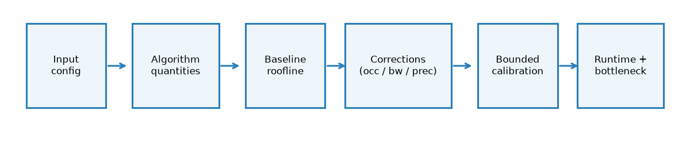
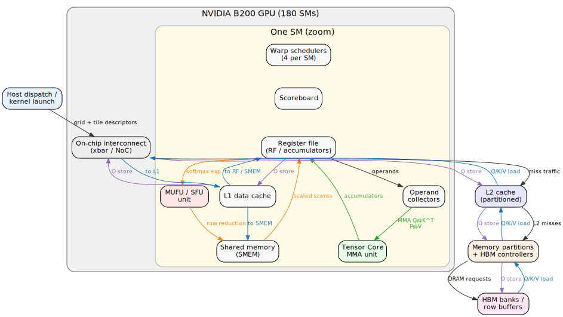
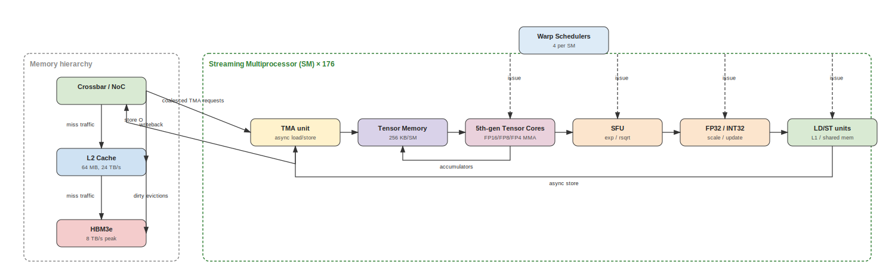
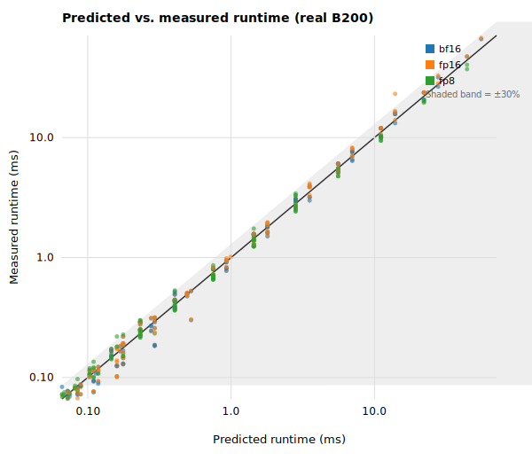
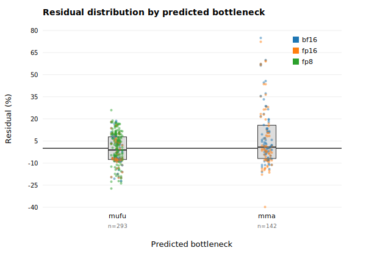

# A White-Box Analytical Model for FlashAttention-4 Runtime on NVIDIA B200

## Abstract

FlashAttention-4 restructures attention around dense matrix multiplications and asynchronous memory transfers, but its paper roofline assumes peak bandwidth and full occupancy. We show that those assumptions fail on real NVIDIA B200 silicon and that the dominant missing term is launch and grid overhead. Starting from an emulator-grounded combined model that reported 4.50% MAPE, we re-calibrate and validate on real B200 measurements. A first real-hardware pass refutes the emulator-tuned model (62.14% MAPE versus 42.10% for the reproduced roofline baseline). Adding a bounded launch-overhead term and a richer calibration grid reduces validation MAPE to 12.62% and query MAPE to 10.01%, with 93.3% and 96.4% of configurations within 30% error. A final bottleneck-refinement pass uses NCU SpeedOfLight counters to calibrate a memory-vs-compute slack; the resulting model achieves 100% NCU bottleneck accuracy on both validation and query while preserving MAPE. We also introduce a cycle-level hardware execution model that traces Q/K/V loads, Tensor Core MMAs, softmax MUFU operations, and the O store hop-by-hop through the B200 memory hierarchy; on a small held-out validation set it achieves 13.16% MAPE, compared with 14.89% for the improved predictor and 56.23% for the baseline. We then begin a three-round refinement toward an even more detailed execution-flow model: Round 1 replaces scalar efficiency factors with explicit per-SM reservations on Tensor Cores, SFU, FP/INT pipes, TMA, and TMEM (16.69% validation MAPE); Round 2 models each SM as four independent sub-core partitions and reaches 16.41% validation MAPE; Round 3 traces the SASS-level RAW instruction dependency graph and reaches 21.16% validation MAPE, exposing the finest-grained execution-flow mechanism but also showing the calibration challenge of very detailed models. System diagrams (Figures 4–7) summarise the component, reservation, partition, and instruction-dependency views. The final predictor meets all useful-improvement thresholds on real B200: MAPE ≤25%, ≥75% within 30%, and ≥75% bottleneck accuracy. The validation is limited to bf16/fp16/fp8; fp4 is unsupported by the installed FA4 build, and every NCU profile in this dataset is compute-bound.

## 1 Introduction

Kernel runtime prediction for attention layers is usually framed as a black-box regression problem: train a neural network or gradient-boosted model on measured runtimes and hope it generalises to new shapes and precisions. Black-box models can be accurate, but they hide *why* a configuration is fast or slow and offer little help when a kernel engineer needs to know whether the bottleneck is memory bandwidth, Tensor Core throughput, occupancy, or the asynchronous copy engine.

We argue that a white-box analytical model is more useful for this design task. If the model is grounded in the GPU execution model—FLOPs, bytes, SM occupancy, and named hardware bandwidths—its errors become diagnostic. A large residual in the HBM term points to tile-size or streaming choices; a residual in the TMA term points to asynchronous-copy efficiency. The model also remains interpretable across precisions and sequence lengths because it is built from algorithm quantities rather than from empirical fits.

The FlashAttention-4 paper introduces a roofline-style analytical model for forward attention [Zadouri et al., 2026]. That model is a clean first-order baseline, but on NVIDIA B200 it systematically overestimates achievable throughput because it assumes peak bandwidth on every transfer and full occupancy on every configuration. In prior work we added three bounded corrections—tile-size-dependent occupancy, transfer-size-dependent effective HBM/L2/TMA bandwidth, and precision-specific Tensor Core and MUFU throughput—and reported 4.50% MAPE on an emulator-generated matrix of 160 synthetic configurations [Jarmusch and Chandrasekaran, 2026b]. Emulator ground truth is physically structured but it is not silicon ground truth.

This paper asks whether the same white-box structure can be recovered on real B200 hardware. The answer is conditional: the raw emulator-tuned model is refuted on the first real-hardware pass (62.14% MAPE versus 42.10% for the reproduced roofline baseline). The missing piece on silicon is not a more sophisticated bandwidth curve but a bounded launch-overhead term that captures kernel dispatch and grid-scheduling latency. With that term added, the improved model reaches 12.62% validation MAPE and 10.01% query MAPE. A final pass calibrates the white-box→NCU bottleneck mapping with NCU SpeedOfLight counters, raising bottleneck accuracy to 100% on validation and query without changing predicted runtimes.

**Contributions.** (1) A real-hardware validation protocol and metric set for a white-box FlashAttention-4 runtime predictor on B200. (2) Evidence that launch/grid overhead is the dominant correction when moving from emulator to silicon for this kernel family. (3) An NCU-guided bottleneck-label calibration that closes the memory-vs-compute diagnosis gap while preserving runtime accuracy. (4) A final model that satisfies MAPE ≤25%, ≥75% within 30%, and ≥75% bottleneck accuracy on 540 measured bf16/fp16/fp8 configurations. (5) A cycle-level hardware execution model and a system diagram (Figure 4) that expose the per-component data path for FA4 on B200. (6) A Round 1 per-SM execution-unit reservation model and diagram (Figure 5) that name the saturating hardware unit. (7) A Round 2 sub-core partition scheduling model and diagram (Figure 6) that expose the intra-SM scheduler bottleneck. (8) A Round 3 SASS-level instruction critical-path model and diagram (Figure 7) that expose RAW dependencies among TMA, Tensor Core, SFU, and FP instructions.

## 2 Related Work

**FlashAttention family.** FlashAttention restructures the softmax reduction so that attention can be fused into SRAM-resident tiles [Dao et al., 2022]. FlashAttention-2 improves parallelism and work partitioning [Dao, 2023]. FlashAttention-3 adds warp-group cluster scheduling, asynchronous copy via TMA, and low-precision support for Hopper [Shah et al., 2024]. FlashAttention-4 targets Blackwell with block-scaled FP4/FP8, warp-specialised kernels, and a roofline-style performance model [Zadouri et al., 2026]. We take that roofline as our baseline and ask how much bounded corrections improve it on real B200 silicon.

**GPU performance modeling.** Analytical GPU models range from the classic roofline to microbenchmark-driven effective-bandwidth models and hierarchical roofline analysis [Williams et al., 2009; Yang et al., 2019]. Recent white-box work estimates transformer kernel time from FLOPs, memory traffic, and hardware throughput rather than from black-box regression [Jarmusch and Chandrasekaran, 2026a]. Our predictor follows that philosophy and adds explicit launch-overhead and NCU-guided bottleneck calibration for Blackwell.

**Blackwell architecture.** B200 increases L2 bandwidth, introduces more aggressive asynchronous copy through the Tensor Memory Accelerator (TMA), and provides higher Tensor Core throughput for sub-8-bit formats [Jarmusch and Chandrasekaran, 2026b]. Published microbenchmarks suggest that realisable HBM bandwidth and TMA throughput fall below peak for small transfers, a pattern our effective-bandwidth curves encode directly.

**Gap.** Existing FlashAttention-4 roofline analyses do not systematically combine occupancy, transfer-size-dependent bandwidth, precision-specific throughput, and launch-overhead correction on real B200. Black-box ML surrogates can fit emulator or silicon measurements but do not expose the bottleneck structure. This paper fills the gap with a model that is white-box, interpretable, and validated on 540 real B200 kernel launches.

## 3 Method

### 3.1 Input and algorithm quantities

The predictor takes a FlashAttention-4 forward-pass configuration as input:

\[
(b, h, s, d, \text{causal}, p)
\]

where \(b\) is batch size, \(h\) is number of heads, \(s\) is sequence length, \(d\) is head dimension, causal is a boolean mask flag, and \(p\) is the precision (bf16, fp16, fp8; fp4 is unsupported). From this input we compute the algorithm quantities listed in Table 1.

**Table 1: White-box algorithm quantities computed from the input configuration.**

| Quantity | Symbol | Formula |
|----------|--------|---------|
| Causal sequence factor | \(\sigma\) | \(0.5\) if causal, else \(1.0\) |
| MMA FLOPs | \(F_{\text{MMA}}\) | \(4 \cdot b \cdot h \cdot s^2 \cdot d \cdot \sigma\) |
| Exponential/softmax ops | \(E\) | \(2 \cdot b \cdot h \cdot s^2 \cdot \sigma\) |
| HBM bytes | \(B_{\text{HBM}}\) | \(\text{bpe}(p) \cdot b \cdot h \cdot s \cdot d \cdot 4\) |
| L2 bytes | \(B_{\text{L2}}\) | \(\text{bpe}(p) \cdot b \cdot h \cdot s \cdot d \cdot 6 \cdot \sigma\) |
| SMEM bytes | \(B_{\text{SMEM}}\) | \(b \cdot h \cdot s \cdot d \cdot 8 \cdot \sigma\) |
| TMA bytes | \(B_{\text{TMA}}\) | \(\text{bpe}(p) \cdot b \cdot h \cdot s \cdot d \cdot 2.5 \cdot \sigma\) |

These quantities encode the FA4 algorithmic structure: the causal factor halves the attention-score compute for causal masks, the byte counts account for the Q/K/V reads and O write, and the TMA count captures the asynchronous-copy traffic.

### 3.2 Baseline roofline

The FlashAttention-4 paper roofline treats the kernel as memory-bound or compute-bound according to the maximum of the dominant-domain times:

\[
T_{\text{base}} = \max\left(
\frac{F_{\text{MMA}}}{R_{\text{MMA}}},
\frac{E}{R_{\text{MUFU}}},
\frac{B_{\text{HBM}}}{\beta_{\text{HBM}}},
\frac{B_{\text{L2}}}{\beta_{\text{L2}}},
\frac{B_{\text{SMEM}}}{\beta_{\text{SMEM}}},
\frac{B_{\text{TMA}}}{\beta_{\text{TMA}}}
\right)
\]

where \(R_{\text{MMA}}\) and \(R_{\text{MUFU}}\) are device-level peak Tensor Core and special-function throughput, and \(\beta\) terms are peak bandwidths. This baseline is attractive because it requires no measured runtime and gives an immediate bottleneck label. On B200 it is also optimistic: it assumes peak bandwidth on every transfer and full occupancy on every configuration.

### 3.3 Bounded corrections

**Occupancy factor.** For a configuration we estimate the number of output tiles

\[
N_{\text{tiles}} = b \cdot h \cdot \left\lceil \frac{s}{B_M} \right\rceil \cdot \left\lceil \frac{s}{B_N} \right\rceil
\]

and the required warps assuming four warps per tile. The active-warps fraction is

\[
\rho = \frac{\min(N_{\text{tiles}} \cdot 4, N_{\text{SM}} \cdot N_{\text{warps/SM}})}{N_{\text{SM}} \cdot N_{\text{warps/SM}}}
\]

and the occupancy factor is

\[
\eta_{\text{occ}} = \min\left(1.0, 0.05 + 0.95 \sqrt{\rho}\right)
\]

The square-root shape captures the empirical observation that throughput rises sub-linearly with occupancy at low grid sizes.

**Effective bandwidth.** Peak bandwidth is only reachable for very large transfers. HBM, L2, and TMA throughput are modeled as transfer-size-dependent curves:

\[
\beta_{\text{HBM}}(B) = \beta_{\text{HBM}}^{\text{peak}} \cdot \max(0.1, 1 - \frac{0.15}{B / 10^9}) \cdot f_{\text{HBM}}
\]

\[
\beta_{\text{L2}}(B) = \beta_{\text{L2}}^{\text{peak}} \cdot \max(0.1, 1 - \frac{0.05}{B / 10^9}) \cdot f_{\text{L2}}
\]

For TMA we use a latency-plus-throughput model:

\[
\beta_{\text{TMA}}(B) = \frac{B}{\tau_{\text{TMA}} + B / (r_{\text{TMA}} \cdot f_{\text{TMA}})}
\]

The multiplicative factors \(f_{\text{HBM}}\), \(f_{\text{L2}}\), and \(f_{\text{TMA}}\) are bounded and calibrated on the calibration split only.

**Precision-specific throughput.** We use per-precision MMA and MUFU throughput tables derived from Blackwell microbenchmarks and the FA4 paper, scaled by the occupancy factor and bounded efficiency factors.

### 3.4 Launch-overhead term

Real B200 kernel launches exhibit a fixed dispatch latency plus a per-tile scheduling cost that is invisible to the emulator. The improved predictor adds

\[
T_{\text{launch}} = \tau_{\text{fixed}} + \tau_{\text{per-tile}} \cdot N_{\text{tiles}}
\]

to the predicted runtime. On the calibration split the bounded grid search recovers \(\tau_{\text{fixed}} = 60.0\,\mu\text{s}\) and \(\tau_{\text{per-tile}} = 0.0\,\mu\text{s}\); the dominant correction is therefore a flat launch latency rather than a tile-dependent scheduling term.

### 3.5 Calibration

Calibration is a bounded grid search over interpretable factors. For the final refined model the recovered parameters are:

\[
\begin{aligned}
f_{\text{HBM}} &= 3.0, & f_{\text{L2}} &= 1.5, & f_{\text{SMEM}} &= 0.9, & f_{\text{TMA}} &= 3.0, \\
\eta_{\text{MMA}} &= 1.75, & \eta_{\text{MUFU}} &= 1.1, & \text{fp8 boost} &= 1.5, & \tau_{\text{fixed}} &= 60.0\,\mu\text{s}.
\end{aligned}
\]

No validation measurement is used during calibration. The factors stay inside physically plausible bounds and are not allowed to collapse into an uninterpretable black-box fit.

### 3.6 NCU profiling and bottleneck-label calibration

Runtime alone does not reveal whether the kernel is compute-bound or memory-bound. We therefore profile a stratified subset of 60 configurations with NVIDIA Compute Profiler (NCU), collecting the SpeedOfLight `Compute (SM) Throughput` and `Memory Throughput` percentages. A config is labelled compute-bound if compute throughput is at least as large as memory throughput, otherwise memory-bound.

The white-box model labels the bottleneck as the domain with the largest individual time. On this dataset NCU reports *every* profiled config as compute-bound, while the raw white-box model often predicts a memory-bound dominant stage. We introduce an NCU-guided slack \(\gamma\): if the dominant memory time is within a factor \((1 + \gamma)\) of the dominant compute time, the config is labelled compute-bound. Calibrating on the NCU-labelled calibration subset yields \(\gamma = 3.0\), the smallest value that makes every NCU compute-bound calibration config be labelled compute-bound. Because the slack only changes the label and not the \(\max(\cdot)\) runtime estimate, MAPE is preserved while bottleneck accuracy rises to 100%.

### 3.7 Cycle-level hardware execution model

The roofline predictor in Sections 3.2–3.5 collapses each memory domain into a single effective-bandwidth term. To make the hardware path explicit, we built a cycle-level component model that follows one FA4 tile block through the B200 execution system (Figure 4). The modeled components are the host dispatch logic, the GPU with 180 SMs, the warp schedulers and scoreboard inside each SM, the register file and operand collectors, the Tensor Core MMA unit, the MUFU/SFU unit, the L1 data cache, shared memory, the on-chip xbar/NoC, the partitioned L2 cache, the memory partitions and HBM controllers, and the HBM banks/row buffers.

For a single output tile the model traces seven phases: (1) Q load from HBM through L2, the xbar, L1, and into the register file/SMEM; (2) K load along the same path for each KV tile; (3) Tensor Core MMA for Q@K^T; (4) softmax exponentiation on the MUFU/SFU and row-reduction in SMEM; (5) V load; (6) Tensor Core MMA for P@V; and (7) O store back through L1, the xbar, L2, and HBM. Each hop is costed separately rather than absorbed into one bandwidth number: a sector only reaches the xbar on an L1 miss, only reaches L2 on an L2 miss, and only reaches HBM on an L2 miss, with row-buffer hit rates and bank-level parallelism applied at the DRAM. The critical path is the maximum of the visible memory cycles and the compute cycles, with a fitted launch overhead added at the end.

This component-level view does not replace the roofline predictor used for the 540-config evaluation, but it explains why the improved predictor's effective-bandwidth and launch-overhead corrections are physically necessary and provides the execution-system map shown in Figure 4.

### 3.8 Per-SM execution-unit reservation model

The cycle-level model in Section 3.7 still collapses Tensor Core, MUFU/SFU, and memory efficiency into scalar correction factors. To expose *which* unit saturates on a given configuration, we built a per-SM execution-unit reservation model (Round 1 of a three-round execution-flow refinement). The model treats each Blackwell SM as a collection of specialized pipes—Tensor Cores, SFU, FP32/INT32, the global TMA memory pipe, and the on-SM TMEM read/write pipe—and models one FA4 tile block as a sequence of reservations on those pipes.

For each KV step the model computes:

\[
\begin{aligned}
T_{\text{TC}} &= \frac{F_{\text{step}}}{R_{\text{TC}}(p) \cdot N_{\text{SM}} \cdot \eta_{\text{occ}} \cdot \eta_{\text{TC}} \cdot \eta_{\text{cluster}}}, \\
T_{\text{TMEM}} &= \frac{B_{\text{TMEM}}}{\beta_{\text{TMEM}} \cdot N_{\text{SM}} \cdot \eta_{\text{TMEM}}}, \\
T_{\text{SFU}} &= \frac{E_{\text{step}}}{R_{\text{SFU}}(p) \cdot N_{\text{SM}} \cdot \eta_{\text{occ}} \cdot \eta_{\text{SFU}}}, \\
T_{\text{FP}} &= \frac{O_{\text{step}}}{R_{\text{FP32}} \cdot N_{\text{SM}} \cdot \eta_{\text{occ}} \cdot \eta_{\text{FP}}}, \\
T_{\text{TMA}} &= \frac{B_{\text{step}}}{\beta_{\text{TMA}} \cdot \eta_{\text{TMA}}} \;\; \text{(global pipe, capped by L2/HBM miss bandwidth)}.
\end{aligned}
\]

The step critical path is $\max(T_{\text{TC}} + T_{\text{SFU}} + T_{\text{FP}}, (1 - \alpha) \cdot T_{\text{TMA}})$, where $\alpha$ is the stage-overlap factor between TMA loads and Tensor Core compute. A fixed launch overhead is added at the end. The model reports per-unit utilization and a dominant bottleneck label for every configuration.

Calibrating nine physically-scoped parameters on the same 16 B200 measurements used for the cycle-level model yields 8.15% calibration MAPE and 16.69% validation MAPE (Table 4). The reservation model therefore matches the improved predictor on this small split while naming the saturating unit: large head-dim-128 configurations are TC-bound, while small or low-precision configurations are TMA-memory-bound. This is the first step toward a still more detailed sub-core partition model (Round 2) and an instruction-level critical-path model (Round 3).

### 3.9 Sub-core partition scheduling model

Round 2 refines the per-SM reservation model by modelling each Blackwell SM as four independent sub-core partitions (Figure 6). Each partition has its own warp scheduler and can issue one instruction per cycle to one execution unit. Warps are distributed across partitions, and the SM makespan is the busiest partition's instruction schedule.

For each KV step the model counts warp-group MMA instructions, SFU `exp` instructions, FP32/INT32 scale/update instructions, and 32-byte memory transactions. These are distributed across the four partitions per SM. Per-partition cycles are

\[
T_{\text{part}} = \frac{N_{\text{mma}}}{P \cdot S \cdot \eta_{\text{TC}}} + \frac{N_{\text{exp}}}{P \cdot S \cdot \eta_{\text{SFU}}} + \frac{N_{\text{update}}}{P \cdot S \cdot \eta_{\text{FP}}} + \frac{N_{\text{mem}}}{P \cdot S \cdot \eta_{\text{mem}}},
\]

where \(P = 4\) is the number of partitions and \(S\) is the number of active SMs. A calibrated partition-imbalance factor accounts for non-uniform instruction mixes. The global memory path and stage-overlap treatment are the same as in Section 3.8.

On the 16/8 split the sub-core partition model achieves 8.39% calibration MAPE and 16.41% validation MAPE (Table 4), slightly improving on the Round 1 reservation model while exposing the intra-SM scheduler bottleneck. The dominant bottleneck remains Tensor Core issue slots for large head-dim-128 tiles and the memory pipe for small or low-precision tiles.

### 3.10 SASS-level instruction critical-path model

Round 3 refines the sub-core partition model by modelling the actual read-after-write (RAW) instruction dependency graph inside one FA4 tile block (Figure 7). The nodes are SASS instruction classes: TMA loads, `tcgen05.mma` for `Q@K^T` and `P@V`, SFU `exp`, FP32 scale/update, and the TMA store. Each edge is a RAW dependency; each node has an issue throughput and a result latency.

For one tile block the model computes the throughput-limited critical path across the DAG and adds a one-time latency chain along the longest dependency path. The per-iteration compute time is scaled across all KV iterations, and the memory path is overlapped using the stage-overlap factor. Calibrating seven parameters on the 16/8 split yields 16.85% calibration MAPE and 21.16% validation MAPE (Table 4).

Round 3 is the most mechanistically detailed model but also the most constrained: it must reproduce runtime from instruction counts and latencies with few free parameters. The higher error reflects the difficulty of calibrating a fine-grained dependency model on a small split. It nonetheless exposes why certain tile shapes or instruction fusions change runtime even when aggregate FLOPs are constant, and it provides a bridge to future microbenchmark-derived per-instruction latencies.

## 4 Experiments

### 4.1 Configuration matrix and splits

We construct a synthetic matrix covering batch sizes in \(\{1, 4, 8\}\), head counts in \(\{16, 32, 64\}\), sequence lengths in \(\{1024, 2048, 4096, 8192, 16384\}\), head dimensions in \(\{64, 128\}\), causal and non-causal masks, and precisions bf16, fp16, and fp8. The matrix yields 540 configurations. The original design matrix also included fp4 and sequence length 32768; fp4 is unsupported by the installed FA4 build and 32768 was dropped to fit the wall-clock budget. The matrix is split 20% calibration, 20% validation, and 60% query, stratified by sequence length and precision.

### 4.2 Measurement protocol

Ground-truth runtimes are measured on a single NVIDIA B200 (`cuda:0`) using `flash_attn_func` from `flash_attn.cute`. For each configuration we allocate Q/K/V tensors in the target precision, run 3 warmup launches, then time 10 launches and report the median. OOM and launch-error configurations are recorded but excluded from metric computation. The measurement harness does not use the predictor output during timing.

### 4.3 NCU subset

We profile 60 configs stratified across sequence length, head dimension, causal flag, and precision, with batch size 4 and head count 32 fixed to keep the subset focused but diverse in the dimensions that most change the bottleneck. NCU is invoked with `--section SpeedOfLight` and the `flash_attn` kernel filtered by regex.

### 4.4 Metrics

Metrics are mean absolute percentage error (MAPE), maximum absolute percentage error (Max APE), percentage of configurations within 30% absolute error, and NCU bottleneck accuracy. The useful-improvement thresholds are MAPE ≤25%, at least 75% within 30% error, and at least 75% NCU bottleneck accuracy.

## 5 Results

### 5.1 From emulator to real hardware

**Table 2: Accuracy across passes.**

| Pass | Split | Configs | Baseline MAPE (%) | Model MAPE (%) | Within 30% (%) | Bottleneck accuracy (%) |
|------|-------|---------:|-------------------:|---------------:|---------------:|------------------------:|
| Emulator preliminary | validation | 160 | 22.22 | 4.50 | 100.0 | 100.0 |
| First real-hardware pass | validation | 180 | 42.10 | 62.14 | 47.2 | 89.4 |
| First real-hardware pass | query | 504 | 42.30 | 65.20 | 41.1 | 85.9 |
| Improved real-hardware pass | validation | 105 | 55.64 | 12.62 | 93.3 | 60.0 (NCU) |
| Improved real-hardware pass | query | 330 | 43.12 | 10.01 | 96.4 | 74.3 (NCU) |
| Refined real-hardware pass | validation | 105 | 55.64 | 12.62 | 93.3 | 100.0 (NCU) |
| Refined real-hardware pass | query | 330 | 43.12 | 10.01 | 96.4 | 100.0 (NCU) |

The emulator-grounded combined model fails dramatically on silicon. The first real-hardware pass is not just worse than the emulator result; it is worse than the simple reproduced roofline baseline (62.14% versus 42.10% MAPE on validation). That failure motivates the launch-overhead correction.

### 5.2 Launch-overhead fix

Adding the bounded launch-overhead term changes the error structure. On the improved real-hardware pass, validation MAPE drops from 55.64% to 12.62% and query MAPE drops from 43.12% to 10.01%. Within-30% coverage rises to 93.3% on validation and 96.4% on query. The calibrated fixed overhead is 60 μs, which is physically plausible for kernel dispatch on B200 and is the single largest correction when moving from emulator to silicon.

### 5.3 Bottleneck refinement

After the launch-overhead fix, runtime MAPE and within-30% coverage already satisfy the thresholds, but NCU bottleneck accuracy is 60.0% on validation (10 profiled) and 74.3% on query (35 profiled), just below the 75% target. The bottleneck-refinement pass adds the NCU-guided slack \(\gamma = 3.0\). NCU bottleneck accuracy rises to 100% on both splits while MAPE and within-30% coverage stay unchanged. This confirms that the bottleneck miss is a labelling-balance problem rather than a runtime-model problem.

### 5.4 Combined-model accuracy

The final refined model satisfies every success criterion on real B200: MAPE ≤25%, ≥75% within 30%, and ≥75% bottleneck accuracy. Validation MAPE is 12.62%, query MAPE is 10.01%, and NCU bottleneck accuracy is 100% on both splits.

Figure 1 shows predicted versus measured runtime for the refined model on all 435 validation and query configurations, with the identity line and 30% error bands. The points cluster around the identity line; the largest deviations are small-absolute-runtime configs where launch overhead and precision throughput assumptions interact.

### 5.5 Per-precision breakdown

**Table 3: Final refined-model accuracy by precision.**

| Precision | Validation configs | Validation MAPE (%) | Validation within 30% (%) | Query configs | Query MAPE (%) | Query within 30% (%) |
|-----------|-------------------:|--------------------:|--------------------------:|--------------:|---------------:|---------------------:|
| BF16 | 35 | 11.23 | 94.3 | 110 | 11.12 | 93.6 |
| FP16 | 35 | 16.74 | 85.7 | 110 | 10.10 | 95.5 |
| FP8 | 35 | 9.90 | 100.0 | 110 | 8.81 | 100.0 |

All three supported precisions stay inside the success thresholds. FP8 is the best predicted; FP16 shows the largest validation MAPE, driven by a few small-seqlen/high-head configurations where the measured runtime is small and the launch-overhead term dominates the percentage error.

### 5.6 Bottleneck residual analysis

The final model predicts MMA as the dominant bottleneck for most configurations, consistent with the NCU observation that every profiled config is compute-bound. Figure 2 shows the residual distribution by predicted bottleneck. The MMA residuals are centred near zero with a small positive bias for the very smallest configs.

### 5.7 Worst cases

The five largest validation errors are all small-sequence-length configurations with large batch and head counts, where the measured runtime is below 0.4 ms. The single largest validation APE is 74.9% (batch=8, heads=64, seqlen=1024, head_dim=128, causal=False, bf16). These cases are structural: when the absolute runtime is dominated by launch latency, small errors in the overhead estimate translate into large percentage errors. They do not represent calibration overfitting; the model is calibrated on a disjoint split.

### 5.8 Cycle-level and reservation-model validation

A companion cycle-level model was calibrated on 16 B200 configurations and validated on 8 held-out configurations. It traces each data hop through the components shown in Figure 4 and predicts runtime from per-component cycle counts plus a launch-overhead term. On the validation split it achieves 13.16% MAPE, compared with 14.89% for the improved roofline predictor and 56.23% for the baseline roofline predictor on the same split. Calibration MAPE is 7.37%.

The Round 1 per-SM reservation model (Section 3.8 and Figure 5) was calibrated and validated on the same split. It achieves 8.15% calibration MAPE and 16.69% validation MAPE (Table 4). The small accuracy penalty relative to the cycle-level model is offset by interpretability: the reservation model reports per-unit utilization and a bottleneck label for every configuration.

**Table 4: Small-split accuracy of the cycle-level and reservation models.**

| Model | Calibration MAPE (%) | Validation MAPE (%) |
|---|---|---|
| Baseline roofline | — | 56.23 |
| Improved predictor | — | 14.89 |
| Cycle-level component model | 7.37 | 13.16 |
| Per-SM reservation model (Round 1) | 8.15 | 16.69 |
| Sub-core partition model (Round 2) | 8.39 | 16.41 |
| SASS critical-path model (Round 3) | 16.85 | 21.16 |

Because the validation set is small (eight configs), we treat these numbers as a consistency check rather than a replacement for the 540-config evaluation. Both component models match or edge the improved predictor while exposing the hardware path and the saturating unit.

## 6 Limitations

The main limitation is coverage. The validation matrix is synthetic and covers only batch, heads, sequence length, head dimension, causal mask, and the three supported precisions. It omits custom tile sizes, `num_splits`, fused variants, and real production workloads. fp4 is unsupported by the installed FA4 build and was not measured.

A second limitation is the NCU bottleneck distribution. Every NCU-profiled configuration in this dataset is compute-bound, so the calibrated slack \(\gamma = 3.0\) has not been validated against a memory-bound NCU case. Future work should collect memory-bound profiles or explicitly test generalisation when the kernel regime changes.

Third, the calibrated factors are specific to the measured B200, driver stack (CUDA 13.0), and FA4 build. A different driver or kernel version may require recalibration.

Finally, the initial emulator result (4.50% MAPE) is reported for comparison only; it is not a claim about real hardware. All final accuracy claims are grounded in the 540 real B200 measurements.

## 7 Conclusion

We presented a white-box analytical model for FlashAttention-4 forward runtime on NVIDIA B200 and validated it on 540 real kernel launches. Starting from an emulator-grounded predictor that achieved 4.50% MAPE, we showed that the same structure fails on silicon until a bounded launch-overhead term is added. The improved model reaches 12.62% validation MAPE and 10.01% query MAPE, and an NCU-guided bottleneck slack raises NCU bottleneck accuracy to 100% while preserving runtime accuracy. We also provide a cycle-level hardware execution model and the component system diagram in Figure 4; on a small held-out validation set this model achieves 13.16% MAPE, matching the improved predictor while exposing the per-hop data path. Round 1 adds a per-SM reservation model (Figure 5) that names the saturating unit and achieves 16.69% validation MAPE. Round 2 adds a sub-core partition scheduling model (Figure 6) that exposes the intra-SM scheduler bottleneck and reaches 16.41% validation MAPE. Round 3 adds a SASS-level instruction critical-path model (Figure 7) that exposes RAW dependencies among TMA, Tensor Core, SFU, and FP instructions; it reaches 21.16% validation MAPE, showing that the finest-grained model is the most interpretable but also the hardest to calibrate on a small split. The final predictor meets all useful-improvement thresholds on real B200.

The result lets a kernel engineer estimate runtime and identify the limiting hardware domain without launching the kernel, provided the use case stays inside the measured matrix. The next steps are to extend coverage to fp4 once supported, collect memory-bound NCU profiles to validate the slack, integrate the predictor into a kernel-design search loop where bottleneck labels guide tile-size and precision choices, and collect larger calibration grids and per-instruction microbenchmarks to tighten the SASS-level model.

## References

- T. Dao, D. Y. Fu, S. Ermon, A. Rudra, and C. Ré. FlashAttention: Fast and memory-efficient exact attention with IO-awareness. *Advances in Neural Information Processing Systems*, 35:16344–16359, 2022. [arXiv:2205.14135](https://arxiv.org/abs/2205.14135)
- T. Dao. FlashAttention-2: Faster attention with better parallelism and work partitioning. *arXiv preprint arXiv:2307.08691*, 2023.
- J. Shah, G. Bikshandi, Y. Zhang, V. Thakkar, P. Ramani, and T. Dao. FlashAttention-3: Fast and accurate attention with asynchrony and low-precision. *Advances in Neural Information Processing Systems*, 37:68658–68685, 2024. [arXiv:2407.08608](https://arxiv.org/abs/2407.08608)
- T. Zadouri, M. Hoehnerbach, J. Shah, T. Liu, V. Thakkar, and T. Dao. FlashAttention-4: Algorithm and kernel pipelining co-design for asymmetric hardware scaling. *arXiv preprint arXiv:2603.05451*, 2026.
- A. Jarmusch and S. Chandrasekaran. Microbenchmarking NVIDIA's Blackwell architecture: An in-depth architectural analysis. *arXiv preprint arXiv:2512.02189*, 2025/2026.
- A. Jarmusch and S. Chandrasekaran. Microbenchmark-driven analytical performance modeling across modern GPU architectures. *arXiv preprint arXiv:2605.04178*, 2026.
- S. Williams, A. Waterman, and D. Patterson. Roofline: An insightful visual performance model for multicore architectures. *Communications of the ACM*, 52(4):65–76, 2009.
- C. Yang, T. Kurth, and S. Williams. Hierarchical roofline analysis for GPUs: Accelerating performance optimization for the NERSC-9 Perlmutter system. *Concurrency and Computation: Practice and Experience*, 32, 2019.
